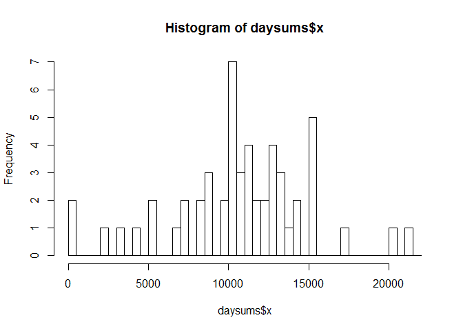
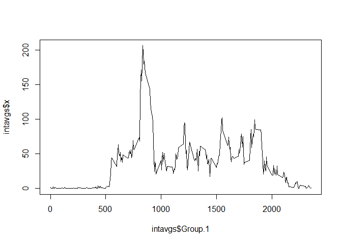
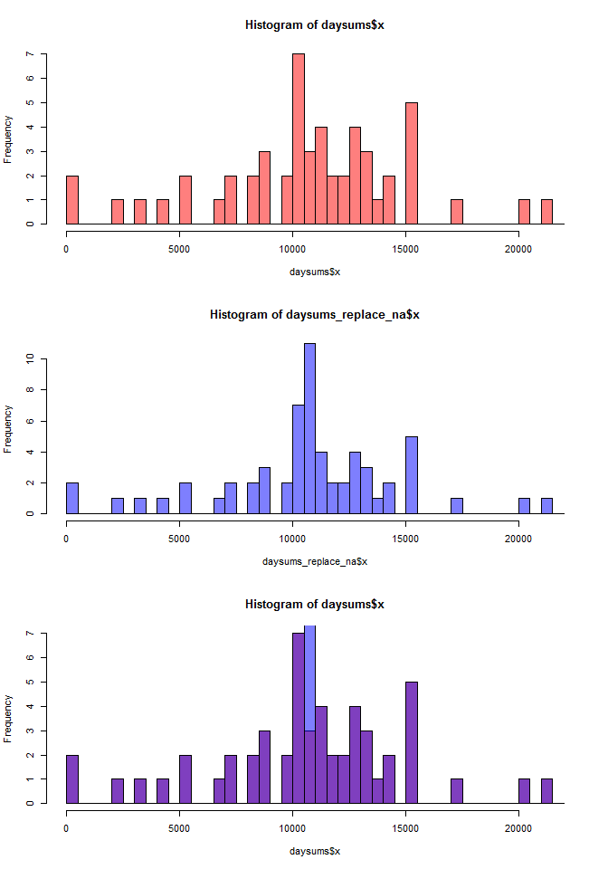
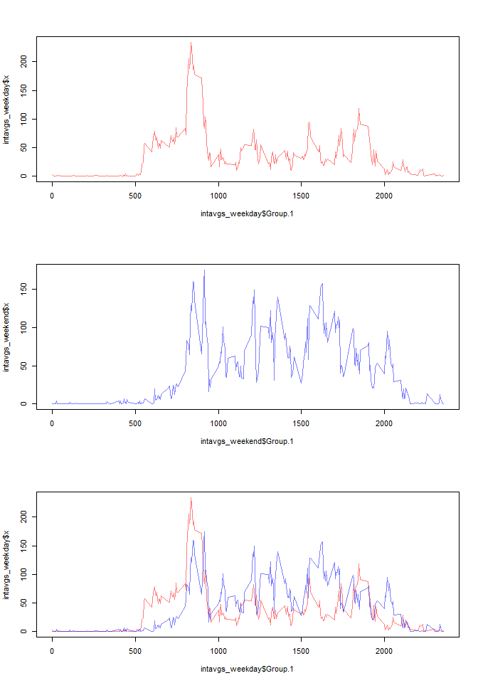

# Reproducible Research: Peer Assessment 1


## Loading and preprocessing the data

```r
activity <- read.csv("activity.csv")
```

## What is mean total number of steps taken per day?

```r
daysums <- aggregate(activity$steps, list(activity$date), sum)
hist(daysums$x, breaks=seq(from=0, to=22000, by=500))
```

 

```r
totalmean <- sprintf("%6.2f", mean(daysums$x, na.rm=TRUE))
totalmedian <- sprintf("%6.2f", median(daysums$x, na.rm=TRUE))
```
The mean steps per day is 10766.19.
The median steps per day is 10765.00

## What is the average daily activity pattern?

```r
activity_nona <- na.omit(activity)
intavgs <- aggregate(activity_nona$steps, list(activity_nona$interval), mean)
plot(intavgs$Group.1, intavgs$x, type="l")
```

 

```r
maxrow <- which.max(intavgs$x)
maxintv <- sprintf("%6.0f", intavgs[maxrow,"Group.1"])
```
The 5-minute interval that on average across all the days contains the maximum number of steps is    835.

## Imputing missing values

```r
# Calculate the number of rows with missing values.
row_na_count <- sprintf("%6.0f", sum(!complete.cases(activity)))
```
The number of activity rows with missing values is   2304.


```r
# Copy the data
activity_replace_na <- activity
# For each row with steps == NA, replace steps with the average steps for that interval.
for(n in which(is.na(activity$steps))) {
    i <- activity_replace_na[n, "interval"]
    activity_replace_na[n, "steps"] <- intavgs[intavgs$Group.1==i, "x"]
}
# Recalculate the histograms with the NA replacement strategy in place.
daysums_replace_na <- aggregate(activity_replace_na$steps, list(activity_replace_na$date), sum)
par(mfrow=c(3,1))
hist(daysums$x, col=rgb(1,0,0,0.5), breaks=seq(from=0, to=22000, by=500))
hist(daysums_replace_na$x, col=rgb(0,0,1,0.5), breaks=seq(from=0, to=22000, by=500))
hist(daysums$x, col=rgb(1,0,0,0.5), breaks=seq(from=0, to=22000, by=500))
hist(daysums_replace_na$x, col=rgb(0,0,1,0.5), breaks=seq(from=0, to=22000, by=500), add=T)
```

 

```r
totalmean_replace_na <- sprintf("%6.2f", mean(daysums_replace_na$x, na.rm=TRUE))
totalmedian_replace_na <- sprintf("%6.2f", median(daysums_replace_na$x, na.rm=TRUE))
```

Results of the NA replacement strategy of replacing NA values with the average interval value:

- The mean steps per day went from 10766.19 to 10766.19.
- The median steps per day went from 10765.00 to 10766.19.


## Are there differences in activity patterns between weekdays and weekends?

```r
# Remove the NA so mean works
activity_days <- activity[!(is.na(activity$steps)),]
# Create the day-of-the-week column
activity_days$day <- as.factor(weekdays(as.Date(activity_days$date)))
# Split into weekday and weekend datasets
activity_weekday <- subset(activity_days, day=="Monday"|day=="Tuesday"|day=="Wednesday"|day=="Thursday"|day=="Friday")
activity_weekend <- subset(activity_days, day=="Saturday"|day=="Sunday")
# Calculate the interval averages over all days in each dataset
intavgs_weekday <- aggregate(activity_weekday$steps, list(activity_weekday$interval), mean)
intavgs_weekend <- aggregate(activity_weekend$steps, list(activity_weekend$interval), mean)
# Show each time-series plot seperately, and then a combined plot
par(mfrow=c(3,1))
plot(intavgs_weekday$Group.1, intavgs_weekday$x, col=rgb(1,0,0,0.5), type="l")
plot(intavgs_weekend$Group.1, intavgs_weekend$x, col=rgb(0,0,1,0.5), type="l")
plot(intavgs_weekday$Group.1, intavgs_weekday$x, col=rgb(1,0,0,0.5), type="l")
lines(intavgs_weekend$Group.1, intavgs_weekend$x, col=rgb(0,0,1,0.5))
```

 

