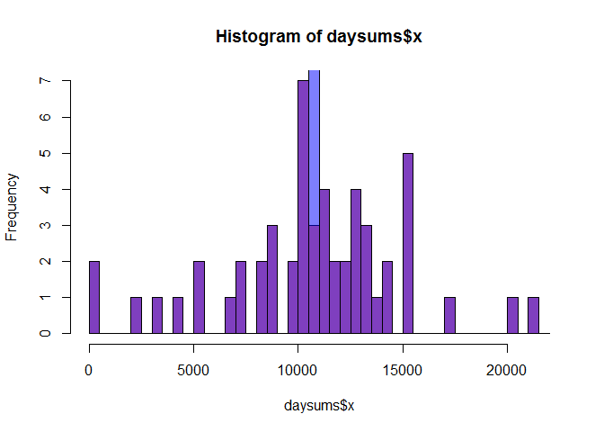

# Reproducible Research: Peer Assessment 1


## Loading and preprocessing the data

```r
activity <- read.csv("activity.csv")
```

## What is mean total number of steps taken per day?

```r
daysums <- aggregate(activity$steps, list(activity$date), sum)
hist(daysums$x, breaks=seq(from=0, to=22000, by=500))
```

 

```r
totalmean <- mean(daysums$x, na.rm=TRUE)
totalmedian <- median(daysums$x, na.rm=TRUE)
```
The mean steps per day is 1.0766189\times 10^{4}.
The median steps per day is 10765

## What is the average daily activity pattern?

```r
activity_nona <- na.omit(activity)
intavgs <- aggregate(activity_nona$steps, list(activity_nona$interval), mean)
plot(intavgs$Group.1, intavgs$x, type="l")
```

 

```r
maxrow <- which.max(intavgs$x)
maxintv <- intavgs[maxrow,"Group.1"]
```
The 5-minute interval that on average across all the days contains the maximum number of steps is 835.

## Imputing missing values

```r
row_na_count <- sum(!complete.cases(activity))
```
The number of activity rows with missing values is 2304.


```r
activity_replace_na <- activity
for(n in which(is.na(activity$steps))) {
    i <- activity_replace_na[n, "interval"]
    activity_replace_na[n, "steps"] <- intavgs[intavgs$Group.1==i, "x"]
}
daysums_replace_na <- aggregate(activity_replace_na$steps, list(activity_replace_na$date), sum)
par(mfrow=c(2,1))
hist(daysums$x, col=rgb(1,0,0,0.5), breaks=seq(from=0, to=22000, by=500))
hist(daysums_replace_na$x, col=rgb(0,0,1,0.5), breaks=seq(from=0, to=22000, by=500))
```

 

```r
par(mfrow=c(1,1))
hist(daysums$x, col=rgb(1,0,0,0.5), breaks=seq(from=0, to=22000, by=500))
hist(daysums_replace_na$x, col=rgb(0,0,1,0.5), breaks=seq(from=0, to=22000, by=500), add=T)
```

 

```r
totalmean_replace_na <- mean(daysums_replace_na$x, na.rm=TRUE)
totalmedian_replace_na <- median(daysums_replace_na$x, na.rm=TRUE)
```
The mean steps per day changed from 1.0766189\times 10^{4} to 1.0766189\times 10^{4}.
The median steps per day changed from 10765 to 1.0766189\times 10^{4}.


## Are there differences in activity patterns between weekdays and weekends?

```r
activity_days <- activity[!(is.na(activity$steps)),]
activity_days$day <- as.factor(weekdays(as.Date(activity_days$date)))
activity_weekday <- subset(activity_days, day=="Monday"|day=="Tuesday"|day=="Wednesday"|day=="Thursday"|day=="Friday")
activity_weekend <- subset(activity_days, day=="Saturday"|day=="Sunday")
intavgs_weekday <- aggregate(activity_weekday$steps, list(activity_weekday$interval), mean)
intavgs_weekend <- aggregate(activity_weekend$steps, list(activity_weekend$interval), mean)
plot(intavgs_weekday$Group.1, intavgs_weekday$x, col=rgb(1,0,0,0.5), type="l")
lines(intavgs_weekend$Group.1, intavgs_weekend$x, col=rgb(0,0,1,0.5))
```

 

